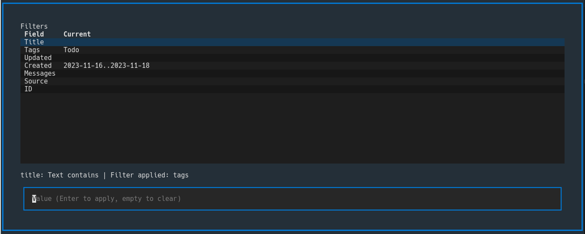
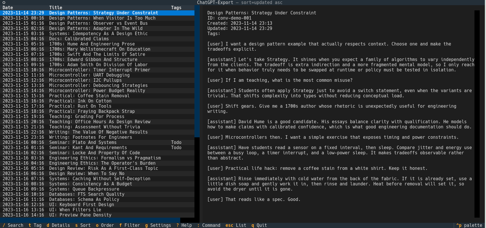

# threadindex

Local, offline conversation inbox for exported ChatGPT chats. threadindex turns your ChatGPT export into a fast, searchable TUI that feels like an email inbox. You'll need the export of your ChatGPT data and can either import the whole zip or single conversation JSON files.

## Screenshots




## Installation

Using pipx (recommended):

```bash
pipx install .
```

Using pip for your user account:

```bash
pip install --user .
```

### Ensure `~/.local/bin` is on your PATH (Linux)

`pip install --user` installs scripts into `~/.local/bin`.

Bash:

```bash
echo 'export PATH="$HOME/.local/bin:$PATH"' >> ~/.bashrc
```

Zsh:

```bash
echo 'export PATH="$HOME/.local/bin:$PATH"' >> ~/.zshrc
```

Fish:

```fish
set -Ux fish_user_paths $HOME/.local/bin $fish_user_paths
```

Arch Linux often already includes `~/.local/bin` in `PATH` for many setups. To check:

```bash
echo $PATH
```

## Usage

Import a ChatGPT export (zip, directory, or single conversation JSON):

```bash
tindex import /path/to/export.zip
```

Then launch the TUI:

```bash
tindex
```

In the TUI:

- `/` enters live search mode.
- Arrow keys move selection.
- `t` tags the selected conversation.
- `s` cycles sort field, `o` toggles sort order.
- `f` opens the filter dialog.
- `g` opens the settings dialog (database selection, import, reindex).
- `:` opens the command bar (for `retitle`, `sort`, `filter`, `details`).

Example commands in the command bar:

- `/python` (search)
- `import /path/to/export.zip`
- `retitle New title for this thread`
- `sort updated desc`
- `filter tag work,ideas`
- `filter updated 2024-01-01 2024-12-31`
- `filter created 2024-01-01 2024-12-31`
- `filter title "planning"`
- `filter clear`

## Data locations (XDG)

threadindex stores everything locally and never uploads data anywhere.

By default:

- Config: `~/.config/threadindex/config.toml`
- Data: `~/.local/share/threadindex/threadindex.db`
- State: `~/.local/state/threadindex/` (logs, import history)
- Cache: `~/.cache/threadindex/`

If `XDG_CONFIG_HOME`, `XDG_DATA_HOME`, `XDG_STATE_HOME`, or `XDG_CACHE_HOME` are set, those paths are used instead.

Config snippet (for chat links in the preview pane):

```toml
[links]
chat_url_base = "https://chatgpt.com/c/"
```

## Updating imports

Imports are idempotent. Re-importing the same export does not duplicate data. If a conversation has new messages or a changed title, it is updated.

## CLI

- `tindex` launches the TUI.
- `tindex import <path>` imports an export zip/dir/file.
- `tindex reindex` rebuilds full-text search.
- `tindex doctor` prints paths and DB status.
- `tindex doctor db-set <database>` sets the default database (full path or name).
- `tindex dump <id>` prints a conversation transcript to stdout.

## Development

Run linting:

```bash
ruff check .
```

Run from source:

```bash
python -m threadindex.cli
```

## License

ISC © 2026 Martin Melmuk. See `LICENSE`.
